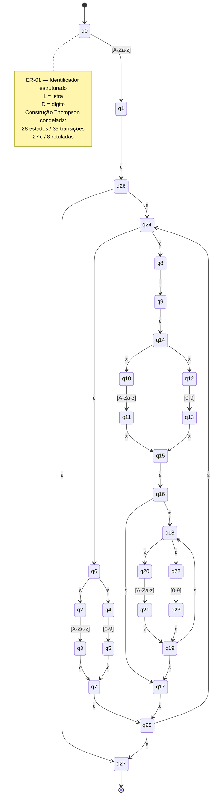

```mermaid
stateDiagram-v2
    direction TB

    [*] --> q0
    q0 --> q1 : [A-Za-z]
    q1 --> q26 : ε
    q6 --> q2 : ε
    q6 --> q4 : ε
    q2 --> q3 : [A-Za-z]
    q3 --> q7 : ε
    q4 --> q5 : [0-9]
    q5 --> q7 : ε
    q8 --> q9 : _
    q9 --> q14 : ε
    q14 --> q10 : ε
    q14 --> q12 : ε
    q10 --> q11 : [A-Za-z]
    q11 --> q15 : ε
    q12 --> q13 : [0-9]
    q13 --> q15 : ε
    q15 --> q16 : ε
    q16 --> q18 : ε
    q16 --> q17 : ε
    q18 --> q20 : ε
    q18 --> q22 : ε
    q20 --> q21 : [A-Za-z]
    q22 --> q23 : [0-9]
    q21 --> q19 : ε
    q23 --> q19 : ε
    q19 --> q18 : ε
    q19 --> q17 : ε
    q24 --> q6 : ε
    q24 --> q8 : ε
    q7 --> q25 : ε
    q17 --> q25 : ε
    q26 --> q24 : ε
    q26 --> q27 : ε
    q25 --> q24 : ε
    q25 --> q27 : ε

    q27 --> [*]

    note right of q0
      ER-01 — Identificador estruturado
      L = letra
      D = dígito
      Construção Thompson congelada:
      28 estados / 35 transições
      27 ε / 8 rotuladas
    end note
```