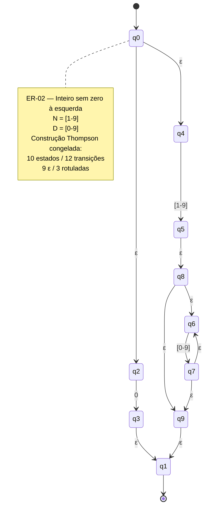

```mermaid
stateDiagram-v2
    direction TB

    [*] --> q0
    q0 --> q2 : ε
    q0 --> q4 : ε
    q2 --> q3 : 0
    q3 --> q1 : ε
    q4 --> q5 : [1-9]
    q5 --> q8 : ε
    q8 --> q6 : ε
    q8 --> q9 : ε
    q6 --> q7 : [0-9]
    q7 --> q6 : ε
    q7 --> q9 : ε
    q9 --> q1 : ε

    q1 --> [*]

    note right of q0
      ER-02 — Inteiro sem zero à esquerda
      N = [1-9]
      D = [0-9]
      Construção Thompson congelada:
      10 estados / 12 transições
      9 ε / 3 rotuladas
    end note
```