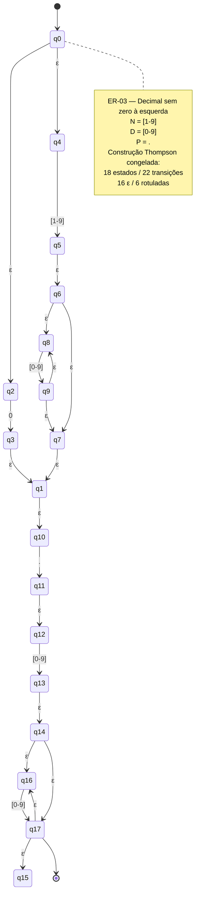

```mermaid
stateDiagram-v2
    direction TB

    [*] --> q0
    q2 --> q3 : 0
    q0 --> q2 : ε
    q3 --> q1 : ε
    q4 --> q5 : [1-9]
    q8 --> q9 : [0-9]
    q6 --> q8 : ε
    q6 --> q7 : ε
    q9 --> q8 : ε
    q9 --> q7 : ε
    q5 --> q6 : ε
    q0 --> q4 : ε
    q7 --> q1 : ε
    q10 --> q11 : .
    q1 --> q10 : ε
    q12 --> q13 : [0-9]
    q11 --> q12 : ε
    q16 --> q17 : [0-9]
    q14 --> q16 : ε
    q14 --> q17 : ε
    q17 --> q16 : ε
    q17 --> q15 : ε
    q13 --> q14 : ε

    q17 --> [*]

    note right of q0
      ER-03 — Decimal sem zero à esquerda
      N = [1-9]
      D = [0-9]
      P = .
      Construção Thompson congelada:
      18 estados / 22 transições
      16 ε / 6 rotuladas
    end note
```