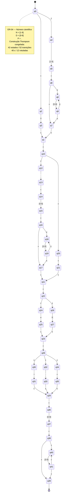

```mermaid
stateDiagram-v2
    direction TB

    [*] --> q0
    q2 --> q3 : 0
    q0 --> q2 : ε
    q3 --> q1 : ε
    q4 --> q5 : [1-9]
    q8 --> q9 : [0-9]
    q6 --> q8 : ε
    q6 --> q7 : ε
    q9 --> q8 : ε
    q9 --> q7 : ε
    q5 --> q6 : ε
    q0 --> q4 : ε
    q7 --> q1 : ε
    q12 --> q13 : .
    q14 --> q15 : [0-9]
    q13 --> q14 : ε
    q18 --> q19 : [0-9]
    q16 --> q18 : ε
    q16 --> q17 : ε
    q19 --> q18 : ε
    q19 --> q17 : ε
    q15 --> q16 : ε
    q10 --> q12 : ε
    q17 --> q11 : ε
    q20 --> q21 : ε
    q10 --> q20 : ε
    q21 --> q11 : ε
    q1 --> q10 : ε
    q24 --> q25 : e
    q22 --> q24 : ε
    q25 --> q23 : ε
    q26 --> q27 : E
    q22 --> q26 : ε
    q27 --> q23 : ε
    q11 --> q22 : ε
    q30 --> q31 : +
    q28 --> q30 : ε
    q31 --> q29 : ε
    q32 --> q33 : -
    q28 --> q32 : ε
    q33 --> q29 : ε
    q34 --> q35 : ε
    q28 --> q34 : ε
    q35 --> q29 : ε
    q23 --> q28 : ε
    q36 --> q37 : [0-9]
    q29 --> q36 : ε
    q40 --> q41 : [0-9]
    q38 --> q40 : ε
    q38 --> q39 : ε
    q41 --> q40 : ε
    q41 --> q39 : ε
    q37 --> q38 : ε

    q39 --> [*]

    note right of q0
      ER-04 — Número científico
      N = [1-9]
      D = [0-9]
      P = .
      Construção Thompson congelada:
      42 estados / 52 transições
      40 ε / 12 rotuladas
    end note
```