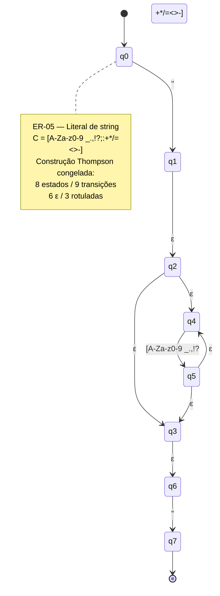

```mermaid
stateDiagram-v2
    direction TB
    [*] --> q0
    q0 --> q1 : "
    q4 --> q5 : [A-Za-z0-9 _.,!?;:+*/=<>-]
    q2 --> q4 : ε
    q2 --> q3 : ε
    q5 --> q4 : ε
    q5 --> q3 : ε
    q1 --> q2 : ε
    q6 --> q7 : "
    q3 --> q6 : ε

    q7 --> [*]

    note right of q0
      ER-05 — Literal de string
      C = [A-Za-z0-9 _.,!?;:+*/=<>-]
      Construção Thompson congelada:
      8 estados / 9 transições
      6 ε / 3 rotuladas
    end note
```