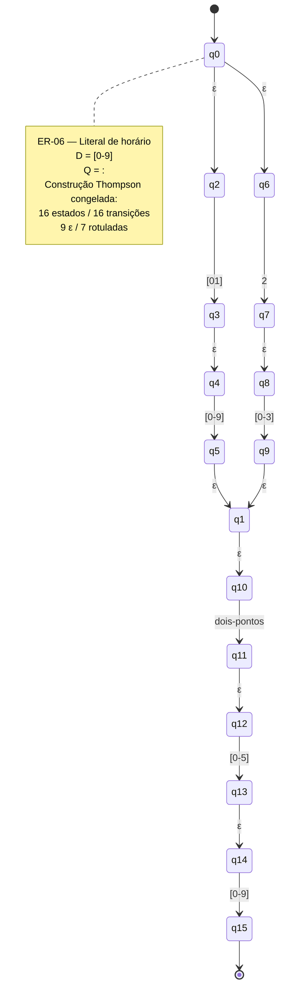

```mermaid
stateDiagram-v2
    direction TB

    [*] --> q0

    q2 --> q3 : [01]
    q4 --> q5 : [0-9]
    q3 --> q4 : ε
    q0 --> q2 : ε
    q5 --> q1 : ε

    q6 --> q7 : 2
    q8 --> q9 : [0-3]
    q7 --> q8 : ε
    q0 --> q6 : ε
    q9 --> q1 : ε

    q10 --> q11 : dois-pontos
    q1 --> q10 : ε

    q12 --> q13 : [0-5]
    q14 --> q15 : [0-9]
    q13 --> q14 : ε
    q11 --> q12 : ε

    q15 --> [*]

    note right of q0
      ER-06 — Literal de horário
      D = [0-9]
      Q = :
      Construção Thompson congelada:
      16 estados / 16 transições
      9 ε / 7 rotuladas
    end note
```